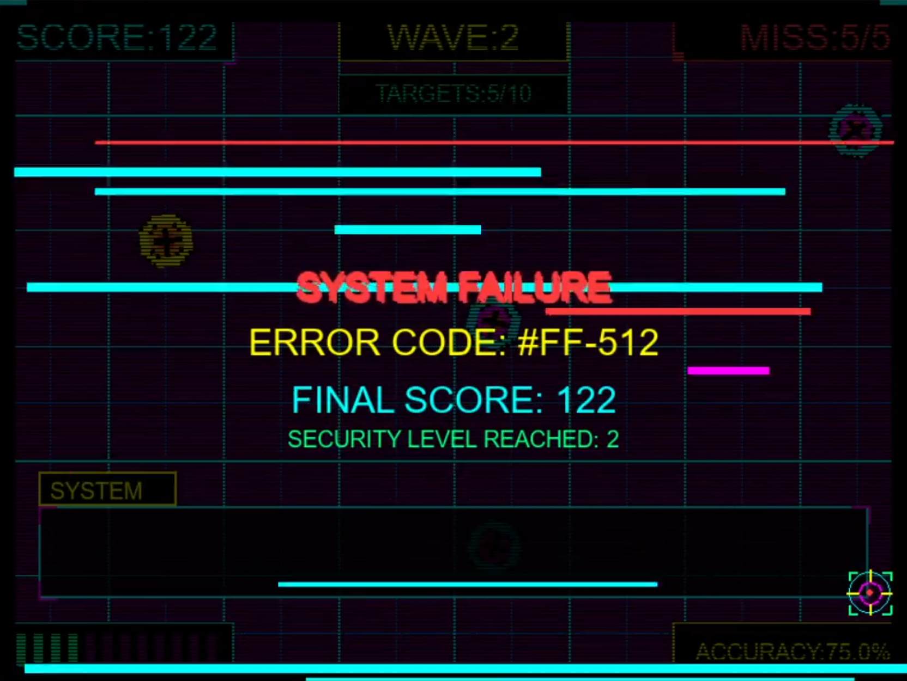

# CYBER RANGE 2099

## 🌐 CYBER RANGE 2099

A cyberpunk-themed shooting gallery game built with Pygame.

## 🎮 Game Description

CYBER RANGE 2099 is a retro-futuristic target shooting game with a cyberpunk aesthetic. In a neon-lit digital grid, players must eliminate holographic targets with precision while managing their ammunition and accuracy. The game features increasing difficulty across multiple waves, dynamic targets, and an immersive synthwave atmosphere.

## 🎥 Demo Video
[](https://www.youtube.com/watch?v=3q_sctsrd08)


## 📷 Screenshots




*Screenshots showcasing the cyberpunk aesthetics and gameplay of CYBER RANGE 2099*

## ✨ Features

- **Cyberpunk aesthetic** with neon colors, scanlines, and digital grid backgrounds
- **Progressive difficulty** across 5 waves with increasingly challenging targets
- **Dynamic targeting system** with moving and rotating objects
- **Ammunition management** with reload mechanics
- **Visual feedback** through particle effects and explosions
- **Score system** based on accuracy and target zones
- **Immersive UI** with cyberpunk-styled HUD elements
- **Synthwave soundtrack** enhancing the futuristic atmosphere

## 🚀 Installation

### Prerequisites
- Python 3.6 or higher
- Pygame library

### Setup
1. Clone this repository or download the source code
2. Install the required dependencies:
```
pip install pygame
```

### Running the Game
Run the game with:
```
python cyberRange2099.py
```

## 🎮 How to Play

- **Mouse Movement**: Aim your targeting reticle
- **Left Click**: Shoot
- **R Key**: Reload manually
- **ESC Key**: Exit the game

### Game Rules
- Targets appear randomly on the screen
- Hit targets to earn points - the closer to the center, the more points you earn
- Missing targets will increase your miss counter
- 5 misses will end the game
- Clear all waves to complete the mission
- Manage your ammo (12 rounds per magazine)
  
## 📋 Requirements

- Python 3.6+
- Pygame 2.0+
- Recommended: 
  - Audio output device for sound effects
  - Mouse for aiming and shooting

## 🎮 Game Features Showcase

The screenshots above highlight several key features of CYBER RANGE 2099:

1. **Cyberpunk Interface**: Neon-lit HUD elements with futuristic targeting systems
2. **Dynamic Environments**: Digital grid backgrounds with scanline effects
3. **Arcade-style Gameplay**: Precision targeting with score tracking and wave progression
4. **Visual Feedback**: Particle effects and color-coded targeting system
5. **Immersive Experience**: Dialog boxes and status messages enhance the game world

The game combines retro arcade shooting gallery mechanics with a rich cyberpunk aesthetic to create an engaging and visually striking experience.

## 🤝 Contributing

Contributions, bug reports, and feature requests are welcome!

## 📜 License

This project is licensed under the MIT License - see the LICENSE file for details.

## 🙏 Acknowledgments

- Inspired by classic games (Duck Hunt, Policenauts & Cyberpunk2077)
- Audio sources have been cited!

---

Developed with ❤️ and lots of neon
